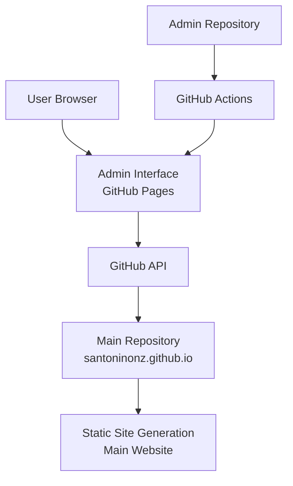

# Architecture Overview

## System Design

The Santo Niño Admin Interface is a **client-side single-page application (SPA)** that integrates directly with the GitHub API to manage content. This architecture was chosen for several key reasons:

### Design Principles

1. **Zero Server Cost**: No backend infrastructure required
2. **GitHub-Native**: Leverages GitHub's existing infrastructure and permissions
3. **Version Control**: All content changes are tracked via Git
4. **Security**: No sensitive data stored on servers
5. **Scalability**: Static hosting scales automatically

## High-Level Architecture



## Component Architecture

### Frontend Application Stack

```
┌─────────────────────────────────────────┐
│               User Interface            │
├─────────────────────────────────────────┤
│  React Components                       │
│  ├─ Authentication (GitHubAuth)         │
│  ├─ Dashboard (PostList, UserInfo)      │
│  ├─ Editor (PostEditor, MDEditor)       │
│  └─ Navigation & Layout                 │
├─────────────────────────────────────────┤
│  Application Logic                      │
│  ├─ State Management (React Hooks)      │
│  ├─ GitHub API Client (GitHubAPI)       │
│  ├─ Content Processing (Markdown/YAML)  │
│  └─ File Upload Handling                │
├─────────────────────────────────────────┤
│  Next.js Framework                      │
│  ├─ App Router                          │
│  ├─ Static Site Generation              │
│  ├─ TypeScript                          │
│  └─ Tailwind CSS                        │
├─────────────────────────────────────────┤
│  Browser APIs                           │
│  ├─ Fetch API (GitHub REST API)         │
│  ├─ Local Storage (Token Storage)       │
│  └─ File API (Image Uploads)            │
└─────────────────────────────────────────┘
```

## Data Flow

### Authentication Flow
```
1. User enters GitHub Personal Access Token
2. Token validated via GitHub API (/user endpoint)
3. Token stored in localStorage
4. User information fetched and displayed
```

### Content Management Flow
```
1. Load Posts:
   GET /repos/{owner}/{repo}/contents/public/posts
   → Parse markdown files
   → Display in dashboard

2. Create/Edit Post:
   User edits content in markdown editor
   → Convert to frontmatter + content
   → Base64 encode content
   → PUT /repos/{owner}/{repo}/contents/public/posts/{filename}

3. Upload Images:
   User selects image file
   → Read file as base64
   → PUT /repos/{owner}/{repo}/contents/public/posts/assets/images/{filename}
   → Return image URL for use in posts
```

## Security Model

### Authentication
- **Client-side only**: No server-side authentication
- **GitHub PAT**: Personal Access Token with `repo` scope
- **Token storage**: Browser localStorage (cleared on logout)
- **Token validation**: Direct API call to GitHub

### Authorization
- **Repository permissions**: GitHub's native permission system
- **Scoped access**: Only repositories the user has access to
- **No elevation**: Admin can't grant additional permissions

### Data Security
- **No server storage**: All data remains in GitHub
- **HTTPS only**: All API communications encrypted
- **No logs**: No sensitive data logged on servers
- **Client-side processing**: All markdown/YAML processing in browser

## GitHub API Integration

### Endpoints Used

| Endpoint | Purpose | Method |
|----------|---------|---------|
| `/user` | Get authenticated user info | GET |
| `/repos/{owner}/{repo}/contents/{path}` | List/read files | GET |
| `/repos/{owner}/{repo}/contents/{path}` | Create/update files | PUT |
| `/repos/{owner}/{repo}/contents/{path}` | Delete files | DELETE |

### Rate Limiting
- **Authenticated**: 5000 requests/hour per token
- **Monitoring**: Not implemented (could be added)
- **Caching**: Browser caching for file listings

## File Structure

### Content Repository Structure
```
santoninonz.github.io/
├── public/
│   └── posts/                    # Blog posts directory
│       ├── post-1.md            # Individual posts
│       ├── post-2.md
│       └── assets/
│           └── images/          # Post images
│               ├── image1.jpg
│               └── image2.png
└── src/                         # Main site source
```

### Admin Repository Structure
```
admin/
├── src/
│   ├── app/                     # Next.js App Router
│   │   ├── layout.tsx          # Root layout
│   │   └── page.tsx            # Main page
│   ├── components/             # React components
│   │   ├── GitHubAuth.tsx      # Authentication
│   │   ├── Dashboard.tsx       # Main dashboard
│   │   ├── PostList.tsx        # Post listing
│   │   └── PostEditor.tsx      # Markdown editor
│   ├── lib/
│   │   └── github-api.ts       # API integration
│   ├── types/
│   │   └── index.ts            # TypeScript definitions
│   └── styles/
│       └── globals.css         # Tailwind styles
├── docs/                       # Documentation
├── .github/workflows/          # CI/CD
└── public/                     # Static assets
```

## Deployment Architecture

### GitHub Pages Deployment
```
1. Developer pushes to main branch
2. GitHub Actions triggered
3. Next.js build process:
   - TypeScript compilation
   - Component bundling
   - Static site generation
   - Asset optimization
4. Output to /out directory
5. GitHub Pages serves static files
6. Available at santoninonz.github.io/admin/
```

### Build Configuration
- **Static Export**: `output: 'export'` in Next.js config
- **Base Path**: `/admin` for GitHub Pages subdirectory
- **Asset Prefix**: Ensures correct asset loading
- **Image Optimization**: Disabled for static export

## Future Architecture Considerations

### Scalability
- **Multiple repositories**: Could extend to manage multiple sites
- **Team collaboration**: Multiple users can work simultaneously
- **Bulk operations**: Could add batch edit/upload capabilities

### Enhancements
- **Real-time collaboration**: Could add WebSocket for live editing
- **Advanced media management**: Organize images in folders
- **Template system**: Pre-defined post templates
- **Backup system**: Automated backups beyond Git history

### Monitoring & Analytics
- **Usage analytics**: Track admin usage patterns
- **Error monitoring**: Centralized error tracking
- **Performance metrics**: Monitor API response times
- **User activity**: Audit logs for content changes

## Technology Decisions

### Why Next.js?
- **Static Site Generation**: Perfect for GitHub Pages
- **App Router**: Modern React patterns
- **TypeScript support**: Built-in type checking
- **Performance**: Optimized bundling and loading

### Why Client-Side Only?
- **Cost**: Zero server costs
- **Security**: No server-side vulnerabilities
- **Simplicity**: No backend to maintain
- **GitHub Integration**: Direct API usage

### Why GitHub API?
- **Native integration**: Uses existing GitHub infrastructure
- **Version control**: All changes tracked automatically
- **Permissions**: Leverage GitHub's security model
- **Reliability**: GitHub's 99.9% uptime SLA

### Why Tailwind CSS?
- **Consistency**: Utility-first approach
- **Performance**: Purged unused styles
- **Maintenance**: No custom CSS to maintain
- **Theming**: Easy dark theme implementation

This architecture provides a robust, secure, and cost-effective solution for content management while maintaining the simplicity and reliability that comes with leveraging GitHub's infrastructure.