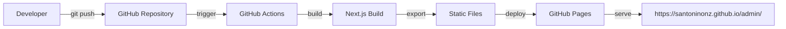

# Deployment Guide

## Overview

The Santo Niño Admin Interface is deployed as a static website on GitHub Pages using GitHub Actions for automated CI/CD. This guide covers the complete deployment process, configuration, and troubleshooting.

## Deployment Architecture



## Prerequisites

### Repository Setup
1. **Repository**: `SantoNinoNZ/admin`
2. **Branch**: `main` (default branch)
3. **Permissions**: Admin access to repository
4. **GitHub Pages**: Enabled in repository settings

### Required Files
- `.github/workflows/deploy.yml` - GitHub Actions workflow
- `next.config.js` - Next.js configuration for static export
- `package.json` - Build scripts and dependencies

## GitHub Actions Workflow

### Workflow Configuration
File: `.github/workflows/deploy.yml`

```yaml
name: Deploy to GitHub Pages

on:
  push:
    branches: [ main ]
  workflow_dispatch:

permissions:
  contents: read
  pages: write
  id-token: write

concurrency:
  group: "pages"
  cancel-in-progress: false

jobs:
  build:
    runs-on: ubuntu-latest
    steps:
      - name: Checkout
        uses: actions/checkout@v4

      - name: Setup Node.js
        uses: actions/setup-node@v4
        with:
          node-version: '18'
          cache: 'npm'

      - name: Install dependencies
        run: npm ci

      - name: Build Next.js app
        run: npm run build

      - name: Create .nojekyll file
        run: touch out/.nojekyll

      - name: Upload artifact
        uses: actions/upload-pages-artifact@v3
        with:
          path: ./out

  deploy:
    environment:
      name: github-pages
      url: ${{ steps.deployment.outputs.page_url }}
    runs-on: ubuntu-latest
    needs: build
    steps:
      - name: Deploy to GitHub Pages
        id: deployment
        uses: actions/deploy-pages@v4
```

### Workflow Explanation

#### Triggers
- **Push to main**: Automatic deployment on every push
- **Manual dispatch**: Can be triggered manually from GitHub Actions tab

#### Build Process
1. **Checkout**: Gets the latest code
2. **Setup Node.js**: Installs Node.js 18 with npm caching
3. **Install dependencies**: Runs `npm ci` for clean install
4. **Build**: Runs `npm run build` to create production build
5. **Create .nojekyll**: Prevents Jekyll processing on GitHub Pages
6. **Upload artifact**: Prepares files for deployment

#### Deploy Process
1. **Deploy**: Uses official GitHub Pages deployment action
2. **Environment**: Sets up GitHub Pages environment
3. **URL**: Returns the deployment URL

## Next.js Configuration

### Static Export Configuration
File: `next.config.js`

```javascript
/** @type {import('next').NextConfig} */
const nextConfig = {
  output: 'export',              // Enable static export
  basePath: '/admin',            // Subdirectory path
  assetPrefix: '/admin',         // Asset URL prefix
  trailingSlash: true,           // Add trailing slashes
  images: {
    unoptimized: true           // Disable image optimization
  },
  typescript: {
    ignoreBuildErrors: false,   // Strict TypeScript checking
  },
}

module.exports = nextConfig
```

### Configuration Explanation

- **output: 'export'**: Generates static HTML files
- **basePath/assetPrefix**: Required for GitHub Pages subdirectory
- **trailingSlash**: Ensures consistent URLs
- **unoptimized images**: Required for static hosting
- **TypeScript**: Ensures type safety in build

### Package.json Scripts
```json
{
  "scripts": {
    "dev": "next dev",
    "build": "next build",
    "start": "next start",
    "export": "next build && next export",
    "deploy": "npm run export && touch out/.nojekyll"
  }
}
```

## GitHub Pages Setup

### Enable GitHub Pages
1. Go to repository **Settings**
2. Scroll to **Pages** section
3. Under **Source**, select **"Deploy from a branch"**
4. Select branch: **main**
5. Select folder: **/ (root)**
6. Click **Save**

### Custom Domain (Optional)
If using a custom domain:
1. Add **CNAME** file to repository root
2. Configure DNS records
3. Enable **"Enforce HTTPS"** in Pages settings

## Deployment Process

### Automatic Deployment
1. **Developer pushes to main branch**
2. **GitHub Actions automatically triggers**
3. **Build process runs** (~2-3 minutes)
4. **Deployment completes**
5. **Site is live** at https://santoninonz.github.io/admin/

### Manual Deployment
```bash
# Local testing
npm run build
npm run export

# Check output directory
ls -la out/

# Manual deployment (if needed)
# Upload 'out' directory contents to GitHub Pages
```

### Deployment Status
Monitor deployment in:
- **Repository → Actions tab**: Build logs and status
- **Repository → Environments**: Deployment history
- **Repository → Settings → Pages**: Configuration and status

## Build Output Structure

### Generated Files
```
out/
├── _next/                    # Next.js runtime and chunks
│   ├── static/
│   │   ├── chunks/          # JavaScript bundles
│   │   └── css/             # Stylesheet files
├── admin/                   # Admin interface files
│   ├── index.html          # Main application page
│   └── _next/              # Asset references
├── .nojekyll               # Prevents Jekyll processing
└── index.html              # Root redirect (optional)
```

### Asset Optimization
- **JavaScript**: Minified and code-split
- **CSS**: Purged and optimized with Tailwind
- **Images**: Served unoptimized (static hosting requirement)
- **Fonts**: Loaded from Google Fonts CDN

## Environment Configuration

### Development vs Production

#### Development
- **URL**: http://localhost:3000
- **Hot reload**: Enabled
- **Source maps**: Available
- **Type checking**: Real-time

#### Production
- **URL**: https://santoninonz.github.io/admin/
- **Static files**: Pre-generated
- **Optimized**: Minified and compressed
- **CDN**: Served via GitHub's CDN

### Environment Variables
No server-side environment variables needed. All configuration is build-time:

```javascript
// Build-time configuration
const config = {
  basePath: '/admin',
  githubApi: 'https://api.github.com',
  repoOwner: 'SantoNinoNZ',
  repoName: 'santoninonz.github.io'
};
```

## Troubleshooting Deployment Issues

### Common Build Failures

#### 1. TypeScript Errors
```bash
# Error: Type checking failed
# Solution: Fix TypeScript errors
npm run build  # Check errors locally
```

#### 2. Dependency Issues
```bash
# Error: Module not found
# Solution: Ensure all dependencies are installed
rm -rf node_modules package-lock.json
npm install
```

#### 3. Build Configuration Issues
```bash
# Error: Export failed
# Solution: Check next.config.js
# Ensure static export is configured correctly
```

#### 4. Asset Path Issues
```bash
# Error: Assets not loading
# Solution: Verify basePath and assetPrefix
# Check that all internal links use relative paths
```

### GitHub Actions Debugging

#### Check Build Logs
1. Go to **Actions** tab in repository
2. Click on failed build
3. Expand log sections to see detailed output
4. Look for error messages and stack traces

#### Common Actions Issues
```yaml
# Issue: Node.js version mismatch
# Solution: Update workflow file
- name: Setup Node.js
  uses: actions/setup-node@v4
  with:
    node-version: '18'  # Match your development version
```

#### Dependency Caching Issues
```bash
# Issue: Build fails due to cache
# Solution: Clear Actions cache or use npm ci
- name: Install dependencies
  run: npm ci  # Instead of npm install
```

### GitHub Pages Issues

#### 1. 404 Errors
- **Cause**: Incorrect basePath configuration
- **Solution**: Ensure basePath matches repository name
- **Check**: Verify URLs in browser developer tools

#### 2. Asset Loading Failures
- **Cause**: Incorrect assetPrefix
- **Solution**: Match assetPrefix to basePath
- **Test**: Check network tab for failed requests

#### 3. Routing Issues
- **Cause**: Client-side routing not supported
- **Solution**: Use hash routing or static generation
- **Verify**: Test navigation between pages

### Performance Issues

#### Large Bundle Size
```bash
# Analyze bundle size
npm install --save-dev @next/bundle-analyzer
# Add to next.config.js for analysis
```

#### Slow Build Times
- **Check**: Dependency count and sizes
- **Optimize**: Remove unused dependencies
- **Cache**: Utilize GitHub Actions caching

## Deployment Best Practices

### Pre-deployment Checklist
- [ ] All TypeScript errors resolved
- [ ] Local build succeeds (`npm run build`)
- [ ] All tests pass (if implemented)
- [ ] Documentation updated
- [ ] Version bumped (if using versioning)

### Code Quality Gates
```yaml
# Add to workflow for quality checks
- name: Type check
  run: npx tsc --noEmit

- name: Lint check
  run: npm run lint

- name: Test
  run: npm run test
```

### Rollback Strategy
1. **Immediate rollback**: Revert last commit and push
2. **Targeted fix**: Create hotfix branch and merge
3. **Emergency**: Disable GitHub Pages temporarily

### Monitoring
- **GitHub Status**: Monitor GitHub Pages service status
- **Performance**: Track build times and deployment frequency
- **Errors**: Monitor for failed deployments

## Security Considerations

### GitHub Actions Security
- **Permissions**: Use minimal required permissions
- **Secrets**: Don't store sensitive data in repository
- **Dependencies**: Keep Actions and Node.js updated

### Deployment Security
- **HTTPS**: Always enabled on GitHub Pages
- **Content**: No sensitive data in static files
- **Access**: Repository access controls deployment access

## Maintenance

### Regular Updates
- **Dependencies**: Update monthly (`npm update`)
- **Node.js**: Keep Node.js version current
- **Actions**: Update action versions in workflow

### Monitoring
- **Build status**: Check failed builds immediately
- **Performance**: Monitor deployment times
- **Usage**: Track admin interface usage

This deployment guide ensures reliable, secure, and automated deployment of the Santo Niño Admin Interface to GitHub Pages.